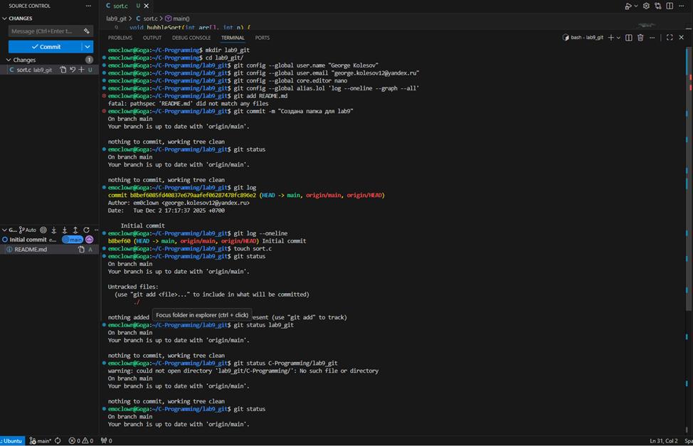
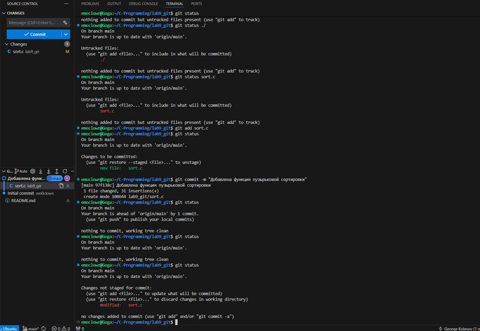
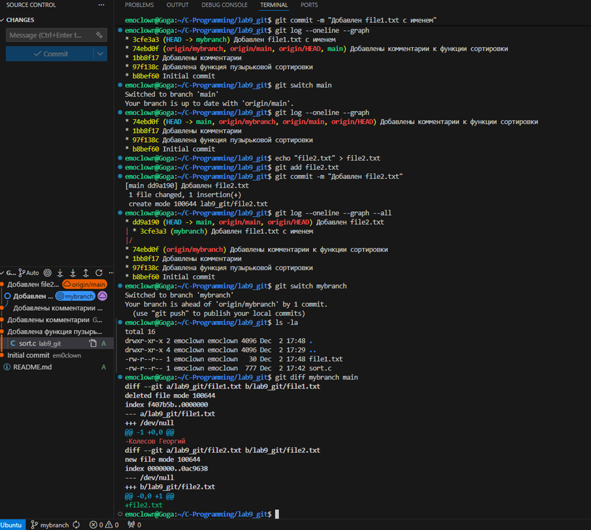
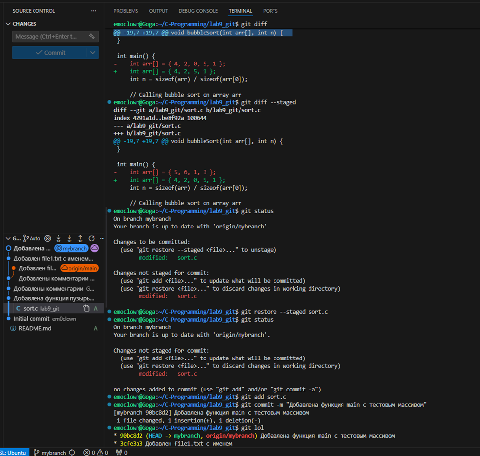
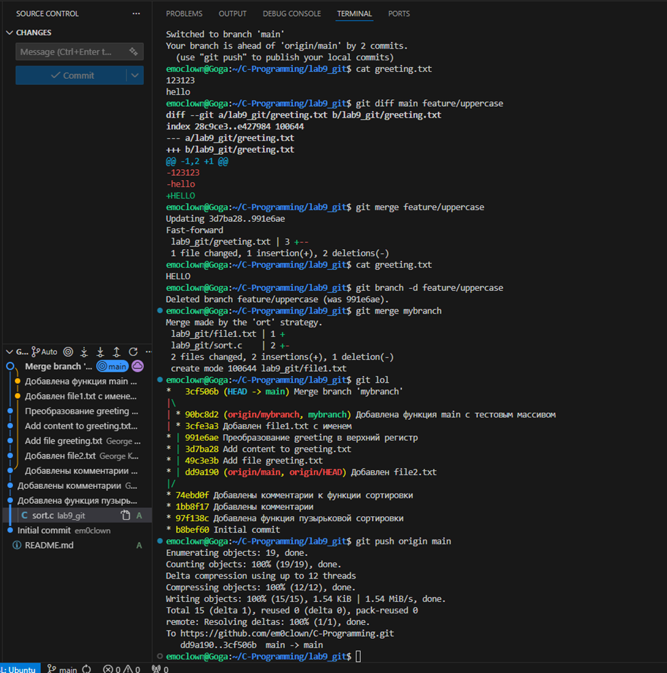
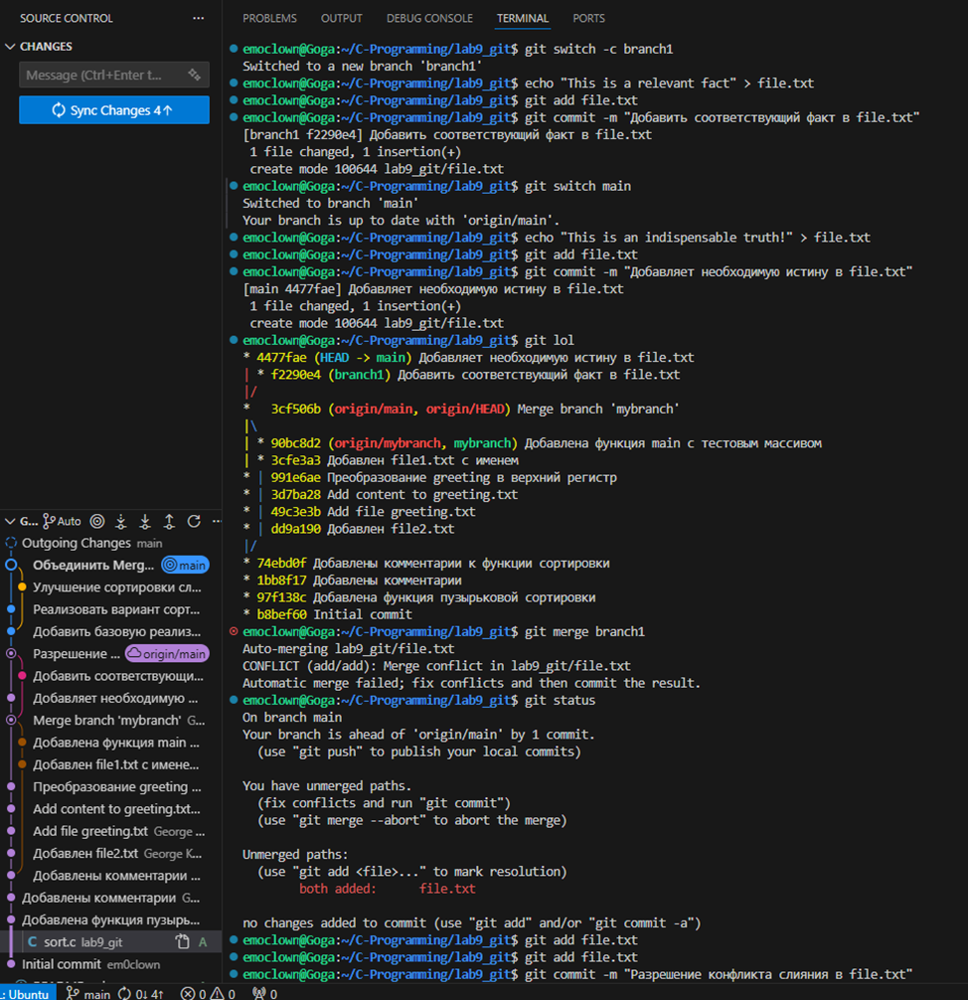
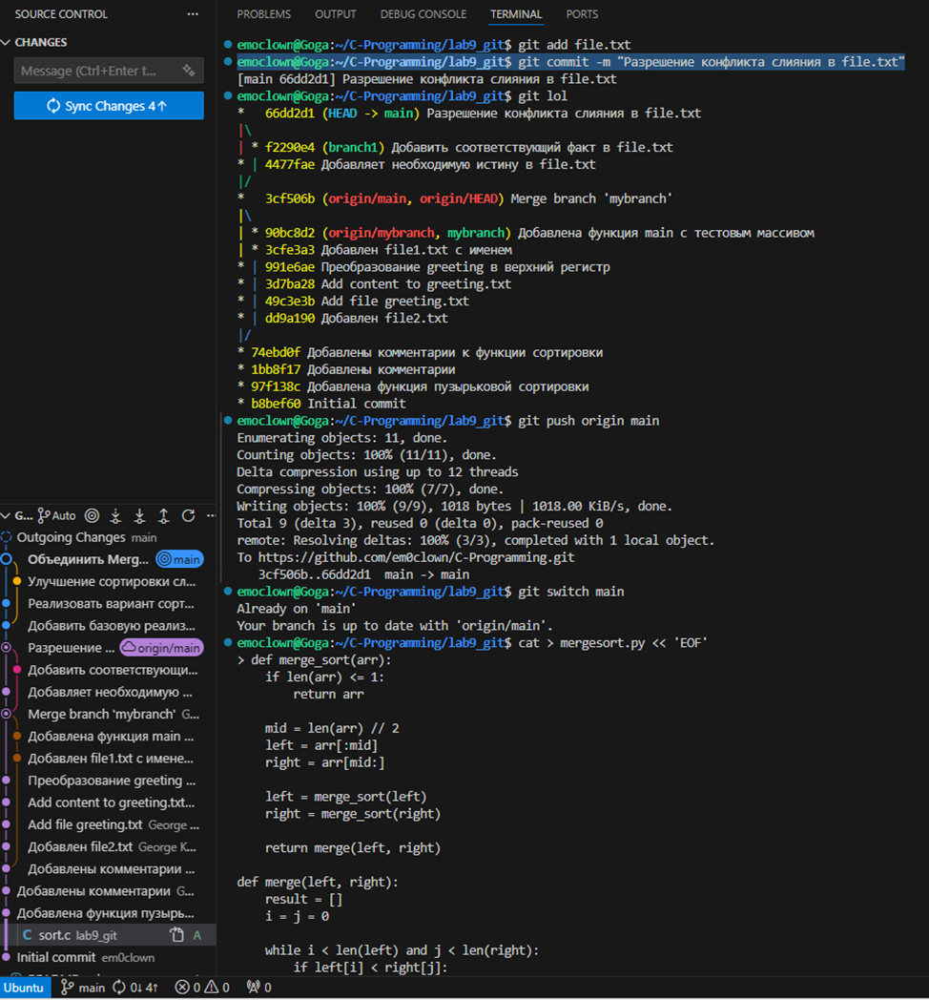

# Лабораторная работа по Git

**ФИО:** [Колесов Георгий Александрович]
**Группа:** [ИКС-532]
**Дата выполнения:** [02.12.25]
**Репозиторий:** [https://github.com/em0clown/C-Programming.git]

## Цель работы
Освоить основные команды системы контроля версий Git, научиться работать с ветками, разрешать конфликты слияния и взаимодействовать с удаленным репозиторием.

## Часть 1: Начальная настройка

### Создание репозитория
1. Создан репозиторий на GitHub
2. Клонирован локально командой: `git clone https://github.com/ваш_username/репозиторий.git`
3. Создана папка для лабораторной работы: `mkdir lab9_git`

### Настройка Git
Выполнены команды начальной настройки:
```bash
git config --global user.name "Ваше Имя"
git config --global user.email "ваш_email@example.com"
git config --global core.editor nano
git config --global alias.lol 'log --oneline --graph --all'
```

*Скриншот 1: Начальная настройка Git*


## Часть 2: Базовые команды Git (Оценка 3)

### Работа с файлом sort.c

1. **Создание файла sort.c** с функцией пузырьковой сортировки:
```c
void bubbleSort(int arr[], int n) {
    for (int i = 0; i < n-1; i++) {
        for (int j = 0; j < n-i-1; j++) {
            if (arr[j] > arr[j+1]) {
                int temp = arr[j];
                arr[j] = arr[j+1];
                arr[j+1] = temp;
            }
        }
    }
}
```

2. **Команды и их вывод:**

| Команда | Результат |
|---------|-----------|
| `git status` | Файл sort.c как неотслеживаемый |
| `git add sort.c` | Файл добавлен в stage |
| `git status` | Файл готов к коммиту |
| `git commit -m "..."` | Создан коммит |

*Скриншот 2: Первый коммит*


3. **Добавление комментариев и работа с изменениями:**
- Добавлен комментарий `// Функция сортировки пузырьком`
- `git status` показал изменение
- `git add sort.c` - добавлено в stage
- Добавлен второй комментарий
- `git commit` без предварительного `git add` не сработал
- `git add` и `git commit` выполнены успешно

### Работа с ветками

1. **Создание ветки mybranch:**
```bash
git branch mybranch
git branch
git switch mybranch
```

2. **Создание файла в ветке:**
```bash
echo "Иванов Иван" > file1.txt
git add file1.txt
git commit -m "Добавлен file1.txt с именем"
```

3. **Возврат в main и создание другого файла:**
```bash
git switch main
echo "Второй файл" > file2.txt
git add file2.txt
git commit -m "Добавлен file2.txt"
```

4. **Сравнение веток:**
```bash
git log --oneline --graph --all
```
*Скриншот 3: Граф расходящихся веток*


## Часть 3: Продвинутая работа с Git (Оценка 4)

### Работа с git diff и git restore

1. **Добавление функции main() в sort.c:**
- Добавлена функция main() с тестовым массивом
- `git diff` показал все изменения
- `git diff --staged` был пуст

2. **Интересный случай с разными состояниями:**
- После `git add sort.c` изменения попали в stage
- Удалено одно число из массива в рабочей директории
- `git diff` показал удаление числа
- `git diff --staged` показал первоначальные изменения

**Объяснение:** Git хранил три версии файла:
- Последний коммит
- Проиндексированные изменения (добавление main)
- Непроиндексированные изменения (удаление числа)

*Скриншот 4: Состояние с двумя разными изменениями*


3. **Отмена индексации:**
```bash
git restore --staged sort.c
git status  # теперь одно объединенное изменение
git add sort.c
git commit -m "Добавлена функция main"
```

### Fast-Forward Merge

1. **Создание ветки feature/uppercase:**
```bash
git switch main
echo "Initial content" > greeting.txt
git add greeting.txt && git commit -m "Add file greeting.txt"
echo "hello" >> greeting.txt
git add greeting.txt && git commit -m "Add content"
git switch -c feature/uppercase
echo "HELLO" > greeting.txt
git add greeting.txt && git commit -m "Convert to uppercase"
```

2. **Слияние веток:**
```bash
git switch main
git merge feature/uppercase  # Fast-forward merge
cat greeting.txt  # Теперь "HELLO"
git branch -d feature/uppercase
```

*Скриншот 5: Fast-forward merge*


## Часть 4: Разрешение конфликтов (Оценка 5)

### Простой конфликт

1. **Создание конфликтующих изменений:**
```bash
git switch -c branch1
echo "This is a relevant fact" > file.txt
git add file.txt && git commit -m "Add relevant fact"
git switch main
echo "This is an indispensable truth!" > file.txt
git add file.txt && git commit -m "Add indispensable truth"
```

2. **Конфликт при слиянии:**
```bash
git merge branch1  # Конфликт!
```

3. **Разрешение конфликта:**
Файл file.txt содержал:
```
<<<<<<< HEAD
This is an indispensable truth!
=======
This is a relevant fact
>>>>>>> branch1
```

Исправлен на: `This is an indispensable and relevant fact!`

### Сложный конфликт с mergesort.py

1. **Создание разных версий сортировки:**

**Ветка main (lefty.py):**
- In-place сортировка
- Изменяет исходный массив
- Другой подход к реализации

**Ветка Mergesort-Impl (righty.py):**
- Функциональная сортировка
- Возвращает новый массив
- Добавлен пример использования

2. **Конфликт слияния:**
```bash
git merge Mergesort-Impl  # Много конфликтов!
```

*Скриншот 6: Конфликт слияния*


3. **Разрешение конфликта:**
Создана гибридная версия, объединяющая лучшие черты обоих подходов:

```python
def merge_sort(arr):
    if len(arr) <= 1:
        return arr
    
    mid = len(arr) // 2
    left = arr[:mid]
    right = arr[mid:]
    
    left = merge_sort(left)
    right = merge_sort(right)
    
    return merge(left, right)

def merge(left, right):
    result = []
    i = j = 0
    
    while i < len(left) and j < len(right):
        if left[i] <= right[j]:  # Стабильная сортировка
            result.append(left[i])
            i += 1
        else:
            result.append(right[j])
            j += 1
    
    result.extend(left[i:])
    result.extend(right[j:])
    
    return result

if __name__ == "__main__":
    data = [38, 27, 43, 3, 9, 82, 10]
    print(f"Исходный массив: {data}")
    sorted_data = merge_sort(data)
    print(f"Отсортированный массив: {sorted_data}")
```

*Скриншот 7: Результат слияния*


## Выводы

### Что было изучено:
1. **Базовые команды Git:**
   - `git init`, `git add`, `git commit`, `git status`, `git log`
   - Работа с удаленным репозиторием: `git push`, `git pull`

2. **Работа с ветками:**
   - Создание и переключение веток (`git branch`, `git switch`)
   - Сравнение веток (`git diff`)
   - Слияние веток (`git merge`)

3. **Разрешение конфликтов:**
   - Понимание маркеров конфликта (`<<<<<<<`, `=======`, `>>>>>>>`)
   - Стратегии разрешения конфликтов
   - Инструменты для разрешения конфликтов

4. **Продвинутые возможности:**
   - Работа с индексацией (`git add`, `git restore --staged`)
   - Просмотр различий (`git diff`, `git diff --staged`)
   - Отмена изменений (`git restore`)

### Практические навыки:
- Создание и ведение репозитория на GitHub
- Организация рабочего процесса с ветками
- Коллаборативная разработка (в теории)
- Документирование изменений

### Трудности и их решение:
1. **Конфликт слияния** - решен ручным редактированием файлов
2. **Путаница с состояниями файлов** - разобраны различия между рабочей директорией, индексом и репозиторием
3. **Потеря изменений** - предотвращена использованием регулярных коммитов

Работа с Git является важным навыком для современного разработчика, и данная лабораторная работа помогла закрепить теоретические знания на практике.

---

## Приложение: Основные команды Git

### Настройка
```bash
git config --global user.name "Имя"
git config --global user.email "email@example.com"
git config --global core.editor nano
```

### Базовые операции
```bash
git init                    # Инициализация репозитория
git add <файл>             # Добавление файла в stage
git commit -m "сообщение"  # Создание коммита
git status                 # Просмотр состояния
git log                    # Просмотр истории
```

### Работа с ветками
```bash
git branch                 # Список веток
git branch <имя>          # Создание ветки
git switch <ветка>        # Переключение ветки
git switch -c <ветка>     # Создание и переключение
git merge <ветка>         # Слияние веток
git branch -d <ветка>     # Удаление ветки
```

### Удаленный репозиторий
```bash
git clone <url>           # Клонирование
git push origin <ветка>   # Отправка изменений
git pull origin <ветка>   # Получение изменений
```

### Полезные алиасы
```bash
git config --global alias.lol 'log --oneline --graph --all'
git config --global alias.st 'status'
git config --global alias.co 'checkout'
git config --global alias.br 'branch'
```

---

**Все скриншоты сохранены в папке `screenshots/` и приложены к отчету.**
```

## Инструкция по использованию:

1. **Скопируйте** этот текст в файл `README.md` в вашем репозитории
2. **Замените** информацию в квадратных скобках `[]` на вашу
3. **Добавьте** реальные скриншоты в папку `screenshots/`
4. **Обновите** описание, если вы делали что-то по-другому
5. **Дополните** выводами и наблюдениями из вашей работы

## Структура папок:
```
your-repository/
├── lab9_git/
│   ├── README.md          # этот файл
│   ├── sort.c             # файл с сортировкой
│   ├── file1.txt          # файл из ветки mybranch
│   ├── file2.txt          # файл из ветки main
│   ├── greeting.txt       # файл для демонстрации merge
│   ├── file.txt           # файл с простым конфликтом
│   ├── mergesort.py       # файл со сложным конфликтом
│   └── screenshots/       # папка со скриншотами
│       ├── git_config.png
│       ├── first_commit.png
│       ├── branch_graph.png
│       ├── two_states.png
│       ├── fast_forward.png
│       ├── merge_conflict.png
│       └── merged_result.png
```

Такой README.md будет хорошо структурирован, информативен и покажет все этапы выполнения лабораторной работы.