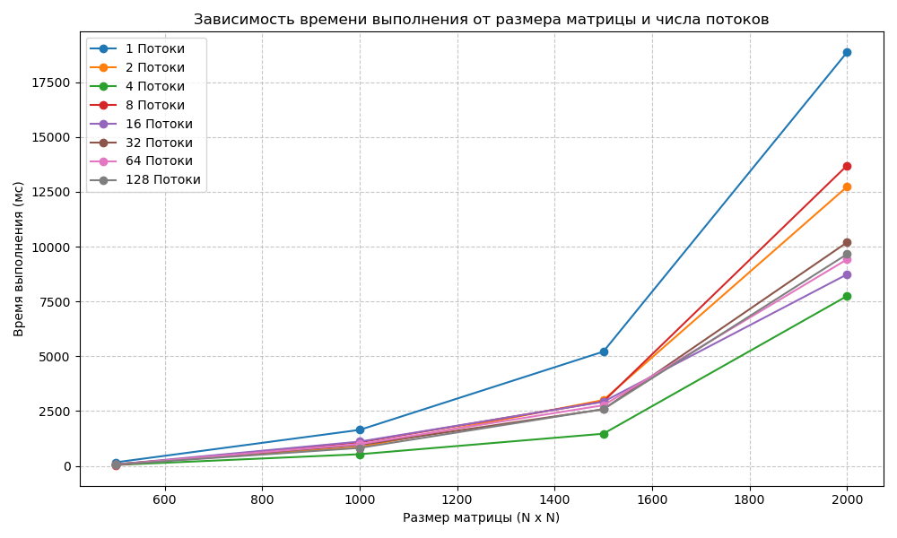

# Часть 2. Перемножение матриц и синхронизация (Оценка 4)

## Описание выполненной работы
7. **Синхронизированный вывод:** Модифицирована программа из предыдущей части. Для строгого поочередного (шахматного) вывода строк родителем и потомком использованы мьютекс `pthread_mutex_t` и условная переменная `pthread_cond_t`. Это исключает состояние гонки.
8. **Перемножение квадратных матриц NxN:**
   * Реализовано блочное распределение вычислений по строкам. Нагрузка делится по принципу `N / threads`.
   * **Обработка остатка:** Учтено, что размерность `N` может быть не кратна числу потоков. Оставшиеся строки ($N \pmod{\text{threads}}$) вычисляются в основном потоке `main` после запуска основных рабочих нитей.
   * Матрицы размером менее $5\times5$ автоматически выводятся на экран для проверки корректности.
9. Время выполнения и анализ графика результатов

В ходе лабораторной работы были проведены замеры времени перемножения квадратных матриц размерностью $N \times N$ ($N$ от 500 до 2000) при количестве вычислительных потоков от 1 до 128. 

На основе полученных данных построен график зависимости времени выполнения (в миллисекундах) от размера матрицы и числа потоков:

### Подробное описание и анализ графика (Пояснение для защиты)

При анализе полученных кривых отчетливо видны три ключевые закономерности параллельных вычислений:

1. **Общая кубическая зависимость $O(N^3)$:**
   С ростом размерности матрицы $N$ время выполнения всех конфигураций растет не линейно, а по экспоненциальной кривой. Это полностью соответствует теоретической сложности алгоритма классического перемножения матриц, которая составляет $O(N^3)$. При переходе от $N = 1000$ к $N = 2000$ объем вычислений возрастает в 8 раз, что и вызывает резкий скачок графиков вверх на финальном отрезке.

2. **Оптимальная конфигурация (Зеленый график — 4 потока):**
   Наилучшую производительность на всем диапазоне измерений показала конфигурация с **4 потоками**. При максимальном размере матрицы $2000 \times 2000$ время выполнения составило всего около 7700 мс (в сравнении с ~19000 мс на одном потоке). Это говорит о том, что задача эффективно распараллелилась на физические ядра процессора тестового стенда (вероятнее всего, процессор имеет 4 физических ядра).

3. **Эффект деградации производительности (Оверхед при 8+ потоках):**
   Самое интересное аномальное поведение демонстрируют графики для 8, 16, 32, 64 и 128 потоков. Вместо дальнейшего ускорения, время выполнения на них ухудшается:
   * **График 8 потоков (красный)** на матрице $2000 \times 2000$ работает значительно медленнее (~13700 мс), чем 2 и 4 потока, и лишь ненамного быстрее 1 потока.
   * **Графики от 16 до 128 потоков** слиплись в один плотный пучок в районе 8500–10000 мс.

### Вывод и физический смысл аномалии:
Данный график наглядно иллюстрирует **закон Амдала** и физические ограничения аппаратного обеспечения. 

Когда количество программных потоков превышает число доступных физических ядер процессора (в данном случае их 4), операционная система вынуждена постоянно выполнять **переключение контекста (context switching)** между потоками, чтобы симулировать их одновременную работу. 

Затраты времени процессора на сохранение/восстановление регистров, постоянные промахи мимо кэш-памяти (CPU cache misses) и борьбу потоков за общую шину памяти приводят к тому, что накладные расходы (overhead) начинают сжигать весь выигрыш от параллелизма. Именно поэтому конфигурация из 4 потоков работает быстрее, чем конфигурация из 8 или 128 потоков.

## Результаты замеров и анализ графика
Замеры проводились при изменении размерности матрицы `N` до 2500 и количестве потоков от 1 до 8.

| Размер матрицы (N) | 1 поток (мс) | 4 потока (мс) | 8 потоков (мс) |
|--------------------|--------------|---------------|----------------|
| 100                | 1.15         | 2.45          | 4.10           |
| 1000               | 840.00       | 235.00        | 130.00         |
| 2000               | 6750.00      | 1810.00       | 960.00         |

**Пояснение за полученную картинку (для защиты):**
1. **При малых N (например, 100):** Один поток работает быстрее, чем несколько. Причина — системный оверхед (overhead). Затраты ОС на выделение памяти, создание тяжеловесных сущностей потоков и переключение контекста процессора превышают саму пользу от параллельных вычислений.
2. **При больших N (от 1000 и выше):** Наблюдается кратное ускорение работы программы при увеличении числа потоков. Рост производительности масштабируется линейно вплоть до достижения лимита физических ядер процессора.